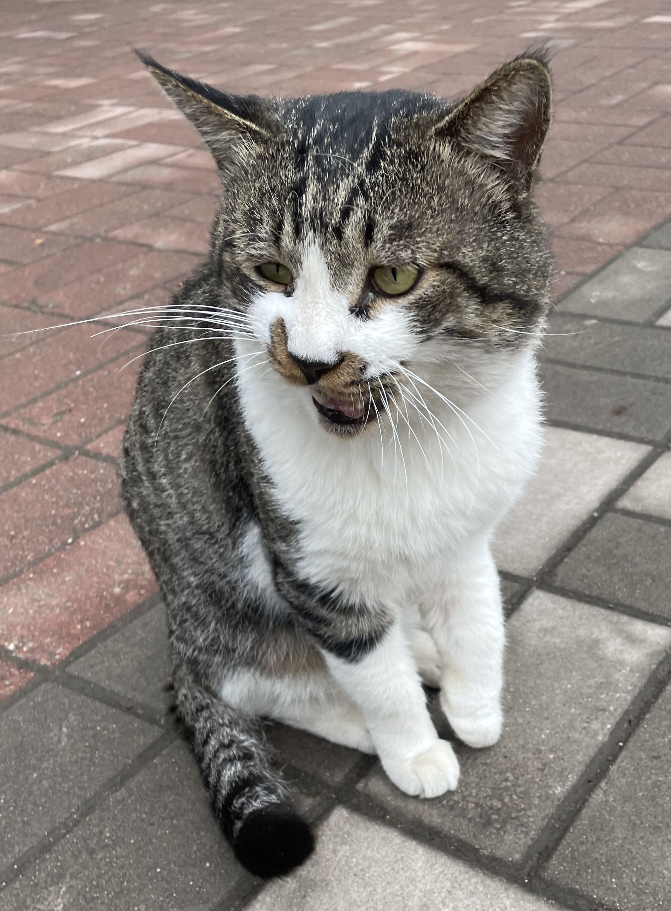
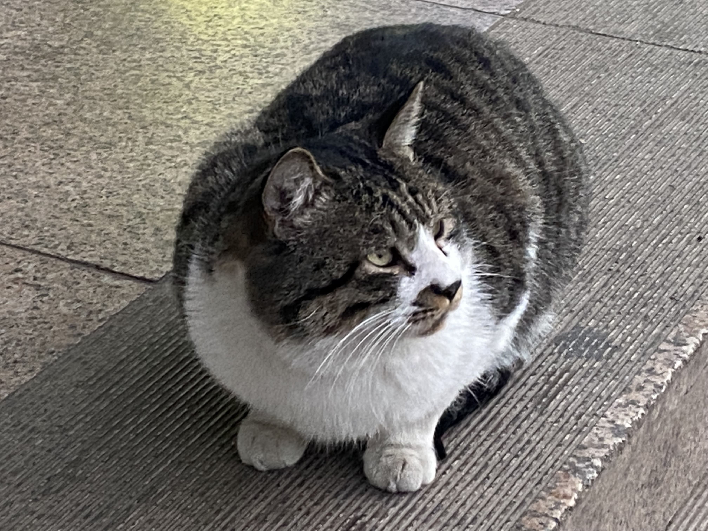

# 大花

性格温顺，亲人可摸。
行踪不定。

识别特征：花纹后背，白色胸腹，嘴鼻处花纹。

前腿曾受过伤，传闻被大学城“猫先生”猫店带走收养治疗，痊愈后放归。

饿了后会主动前往食堂门口、宿舍楼门口等待好心人投食。

现在也被喂成猫球啦。

---

2021/12/24更新：

关于大花到作者宿舍留宿的事情，参见杂谈栏目中的[大花临幸117宿舍](杂谈（大花临幸117宿舍）.md)。

