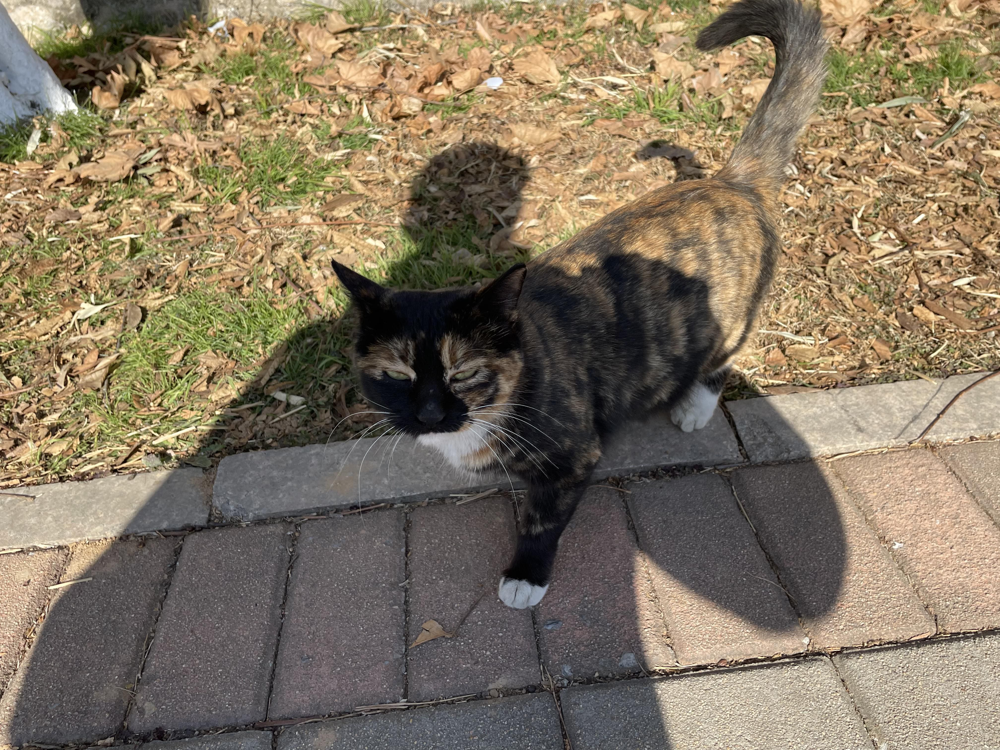
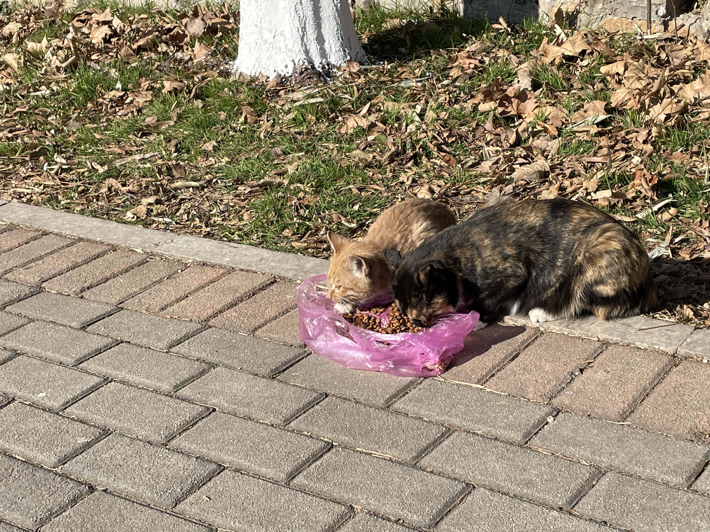
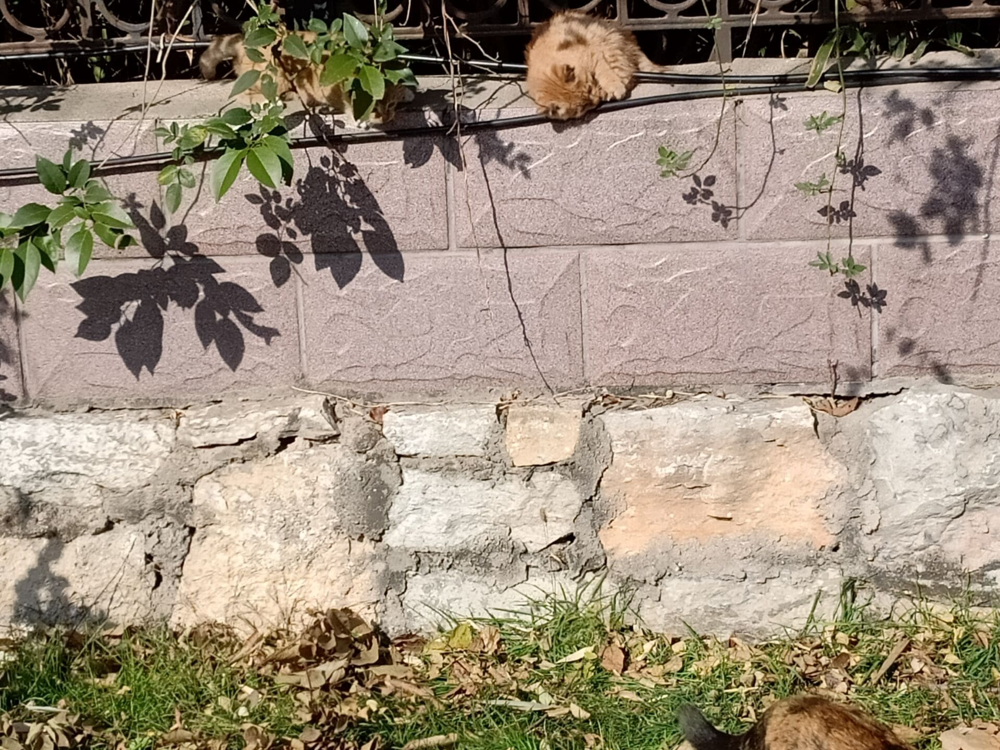
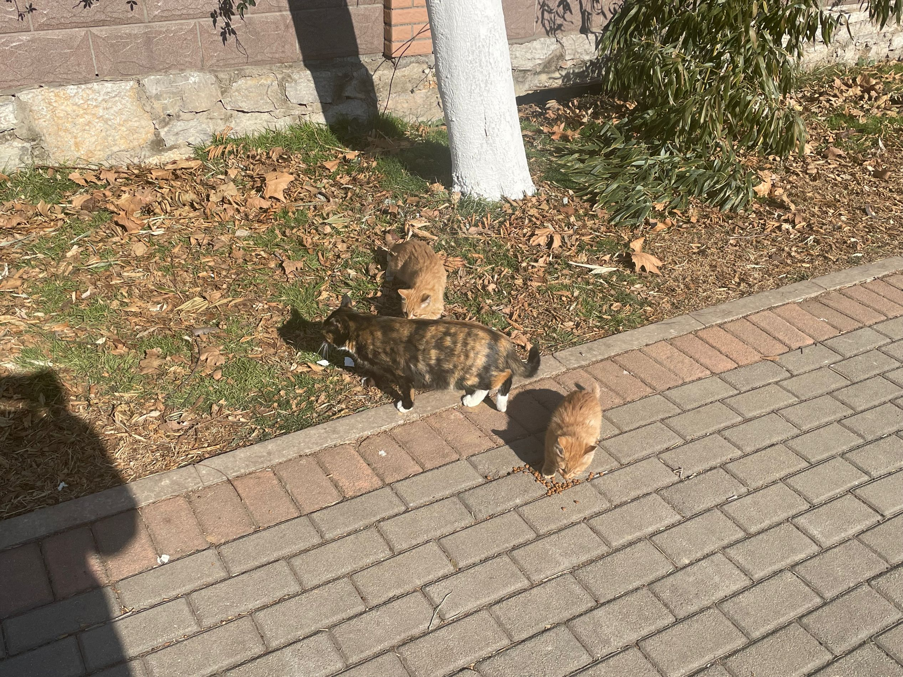

# 猫妈（黑黄）

**警告：这是一只带有幼崽的母猫，警惕性强，怕人，具有攻击性。曾抓伤路人。**

常驻于操场北门，教师公寓栅栏附近。

识别特征：黑黄相间毛色，大概率带领一只黄色猫崽游荡。

曾经育有两只小猫崽，2021年11月20日左右，有一只小猫崽夭折或被人抱走。

---

2021/12/26更新：

原来两只小崽子都还在。有一只胆小不敢出栅栏，再加上两只猫崽长得太像难以分辨，导致作者错误的认为少了一只小猫。 

